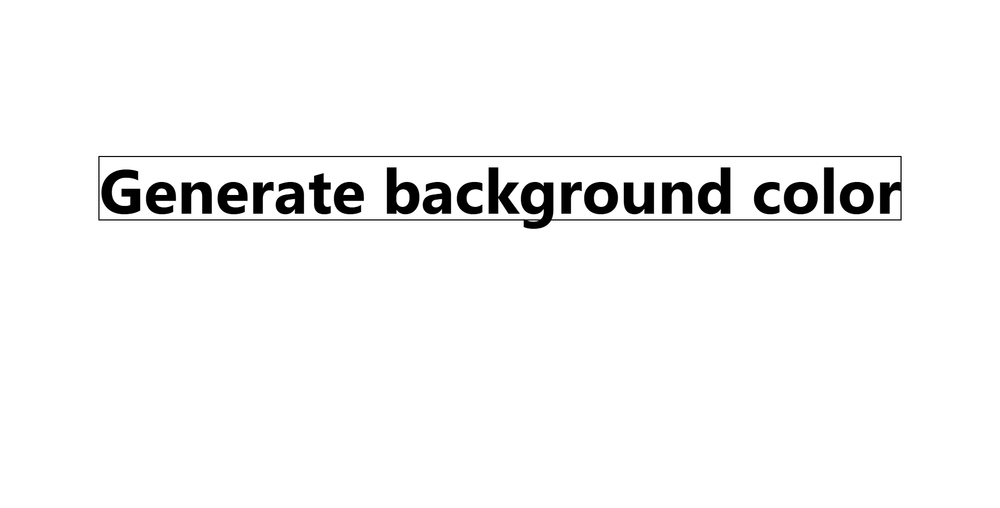
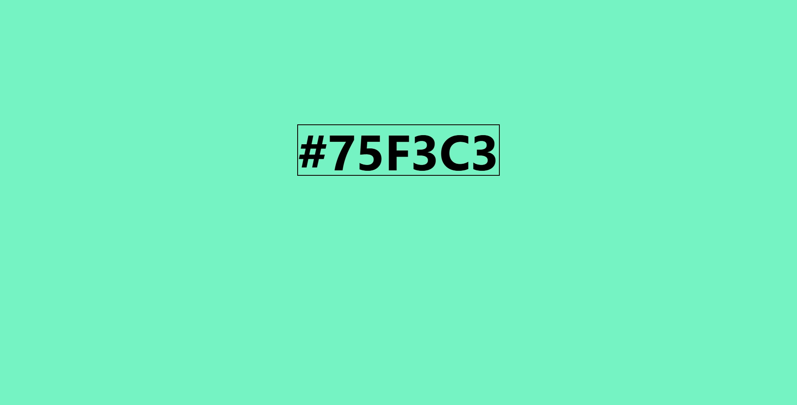

RandomBG

A simple web app that generates a random background color when the button is clicked.

Features

Generate random background colors
Minimal and clean UI
Built with HTML, Tailwind CSS, and JavaScript

[Live@](randombground.netlify.app)

